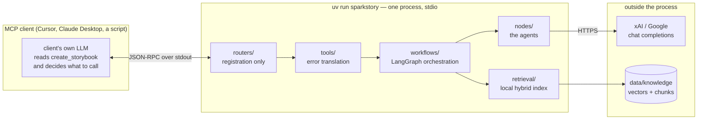
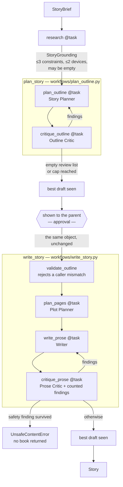
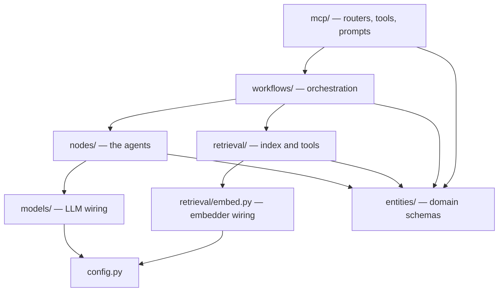
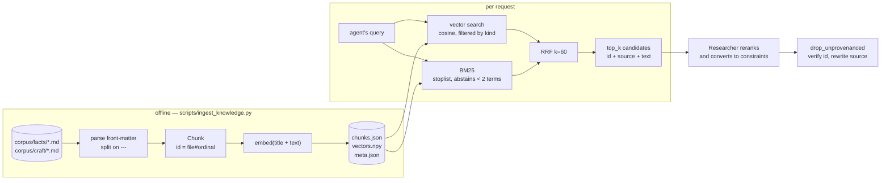

# SparkStory — system design

The full design, as built through Session 5. `README.md` says how to run it and
`CLAUDE.md` says what has been decided and why; this document says how the pieces fit
together and what rules govern each boundary.

Everything described here exists and runs. Where something is designed but not built, it is
marked **[deferred]** with the reason.

---

## 1. What the system is

An **MCP server** that turns a short idea into a personalised children's storybook. A parent
describes their child — name, age, pronouns, reading level, interests, things to avoid — plus
a premise. The system researches what the story must not get wrong, plans it, has a critic
judge the plan, shows the parent that plan, and only then writes the prose.

Two properties shape every decision below.

**It writes for one named child.** Not a generic audience. That is why `avoid` is a hard
constraint with a fail-closed gate, why the child's name never appears in an INFO log, and
why the safety rubric is the one rubric not required to justify itself with evidence.

**A model's output is never trusted structurally.** Every LLM boundary is a Pydantic schema,
and cross-model arithmetic (a beat needs a page) is validated in code as well as stated in a
prompt.

---

## 2. Runtime topology



**One process, no services.** No database, no queue, no vector server, no tracer. The only
network calls are chat completions; retrieval is local files and numpy.

**stdout is reserved.** MCP stdio carries JSON-RPC on stdout, so all logging goes to stderr
and `run()` is called with `show_banner=False`. A stray `print()` corrupts the protocol and
surfaces as a JSON parse error that looks nothing like its cause.

---

## 3. The MCP surface

Two tools and one prompt. That is the whole public API.

| Endpoint | Signature | Cost |
|---|---|---|
| `plan_story` | `(brief: StoryBrief) -> StoryOutline` | 3–5 model calls |
| `write_story` | `(brief: StoryBrief, outline: StoryOutline) -> Story` | 3–7 model calls |
| `create_storybook` | `() -> str` (a prompt) | 0 — returns instructions |

### Why the split is where it is

`plan_story` returns the plan **a parent approves**, and `write_story` takes that plan back
as a required argument. Before Session 8 the pipeline planned again internally, so the parent
approved one story and received another — invisible until two runs happened to name the same
fox Finn and Kit.

The consequence is that the approval point sits *between* two tool calls, and the outline has
to survive a round trip through an untrusted client. It does: verified byte-identical against
a live client.

### The confirmation step is advisory

`create_storybook` returns a string telling the client's LLM to gather a brief, call
`plan_story`, show the parent the whole outline, **stop**, and only then call `write_story`
passing that outline through unchanged.

Nothing server-side enforces that a human approved anything. This follows the course's own
answer to the same requirement (`brown` has zero `interrupt()` calls; its human-in-the-loop is
a tool *argument*). What the server does enforce is that **a plan exists and fits the brief** —
`validate_outline` rejects a mismatch in the tool layer before any model call is paid for.

**[deferred]** The enforced variant — one entrypoint, `interrupt()`, a checkpointer, a resume
tool — buys tamper-resistance, not human verification. Whatever resumes a paused run is still
a client that can claim an approval it never obtained.

---

## 4. End-to-end flow



**Call budget.** Six calls when both critics approve immediately, twelve at the ceiling.
Nothing plans twice.

**Both loops run N revisions and N+1 critiques**, so every draft is critiqued — including the
last. Two independent reasons forced this: a fail-closed gate must judge the draft being
*returned*, and a loop that keeps its best draft cannot score one it never critiqued. The
consequence is that `MAX_*_REVISIONS=0` means "critique once, never revise", not "skip the
critic".

**Both loops return the best draft, not the last.** A revision can be worse than what it
replaced and the loop cannot tell — it re-critiques and sees a *different* set of findings,
not a better book. `draft_score` ranks on `(has_safety_finding, count)`, so a safe draft
always beats a smaller unsafe one and a tie keeps the earlier draft. Observed necessary three
times: prose loops have gone 4→1→3, 5→3→3 and 4→1→5, and in each case best ≠ last.

---

## 5. Layers and dependency rules



Rules that hold in both directions:

- **`entities/` depends on nothing.** Domain schemas know about no provider, no framework
  beyond Pydantic, no storage.
- **`nodes/` never constructs a model.** It receives a runnable. If a node reaches for
  provider details, widen the seam rather than bypass it.
- **`workflows/` owns every decision about control flow**, including whether to continue when
  something failed. A node raises; the workflow decides what that means.
- **`mcp/` contains no logic.** `routers/` registers, `tools/` translates errors.

**`models/` means LLM wiring, not domain models.** Domain schemas live in `entities/`. This
follows the course's newest reference app but is the *reverse* of its earlier one, so a course
snippet's `models` import must be read before it is trusted.

---

## 6. The four seams

Everything cross-cutting attaches at exactly one of these.

### 6.1 `models/get_model.py::get_chat_model(model_id)`

The only place a chat model is constructed. Resolves registry params, looks up the API key
with a precise error naming it, delegates retries to LangChain. Tracing, cost audit, rate
limiting and provider fallback all belong here when they arrive.

**Structured output is deliberately not here** — it is bound by the node, because a node's
output schema is its contract and every node's differs, so there is nothing shared to
centralise.

### 6.2 `retrieval/embed.py::get_embedder(model_id)`

The second model seam, and a sibling rather than a widening: a chat model takes messages and
binds a schema, an embedder takes strings and returns vectors. One factory would only branch
on which kind an entry was.

Behind it: lazy cached weight loading (importing the package reaches no network), and
**unit-length normalisation**, so a dot product *is* a cosine and no caller has to remember
whether it already normalised.

### 6.3 `config.py` — two registries, two levels

```
llm_configs:        name -> {identifier, api_key_env_var, params}
embedding_configs:  name -> {identifier, dimensions}          # no credential
*_model settings:   which registry entry each agent uses
```

Adding an agent adds one settings field, not a model id plus a temperature plus a retry count.
Running the same model at two temperatures is two registry entries and no code — which is how
`grok-3-mini-critic` (temperature 0.0) and `grok-3-mini-researcher` (0.2) exist.

`embedding_configs` entries carry **no `api_key_env_var`**, and that absence is the point:
these models run locally.

### 6.4 `mcp/tools/` — the error boundary

Only `ConfigurationError` and `UnsafeContentError` are translated into `ToolError`. Everything
else propagates as a real bug. The distinction is drawn on our own exception types, never on a
built-in: an earlier version caught `RuntimeError` to mean "missing API key", which would
relabel any unrelated `RuntimeError` as a configuration problem.

---

## 7. Domain model

All in `entities/`. **Docstrings and field descriptions here are prompt text** — Pydantic's
JSON schema is what the model receives, so a class docstring becomes the schema `description`
and each `Field(description=...)` becomes a per-property instruction. Engineering rationale
goes in `#` comments, which never reach a model. There is a regression test asserting no
internal term leaks.

### Input

| Model | Key constraints |
|---|---|
| `ChildProfile` | `name` 1–40, `age` 2–12, `pronouns` enum defaulting to **they/them**, `reading_level` enum, `interests` ≤10 |
| `StoryBrief` | `premise` 3–500, `tone` enum, `page_count` 4–24, `must_include` ≤10, `avoid` ≤10 |

`pronouns` defaults to they/them as a correctness decision, not a stylistic one: a name does
not indicate someone's pronouns, and the story refers to the child throughout.

### Produced by models

| Model | Shape | Notes |
|---|---|---|
| `StoryGrounding` | `facts` ≤3, `craft_devices` ≤2 | **neither has `min_length`** |
| `GroundedFact` | `claim`, `story_constraint`, `source`, `chunk_id` | only `story_constraint` reaches the planner |
| `CraftDevice` | `device`, `how_to_use`, `chunk_id` | |
| `StoryOutline` | `title`, `logline`, `theme`, `characters` 1–6, `beats` 4–8 | |
| `PagePlan` | `pages` 4–24 of `ScenePlan` | three orthogonal notes per page |
| `StoryProse` | `pages` 4–24 of `StoryPage` | |

### Assembled in code

`Story` = `outline` + `page_plan` + `pages`. No LLM ever returns it, so — uniquely — its
docstring and field names are *not* prompt text.

### Two schema rules that cost real debugging

**An empty list must validate wherever emptiness is meaningful.** A reflexive `min_length=1`
on a reviews field makes a revision loop's stop signal unreachable, and the symptom is not a
schema error, it is "the critic never approves". Same for `StoryGrounding`: requiring one fact
would not produce a schema error, it would produce invented facts.

**Cross-model arithmetic needs both halves.** `len(outline.beats) <= brief.page_count` spans
two models that each validate fine alone (briefs allow 4–24 pages, outlines 4–8 beats). The
planner's prompt states the cap as a number *and* `validate_outline` rejects a violation — the
prompt prevents, the validator only rejects after a call has been paid for.

---

## 8. The agents

Six. The working definition: *an agent has autonomy over tool selection or control flow; a
deterministic transform is a workflow node.*

| Agent | Reads | Produces | Model setting |
|---|---|---|---|
| **Researcher** | brief | `StoryGrounding` | `RESEARCHER_MODEL` |
| **Story Planner** | brief, grounding, reviews | `StoryOutline` | `PLANNER_MODEL` |
| **Outline Critic** | brief, outline | `OutlineReviewsOutput` | `OUTLINE_CRITIC_MODEL` |
| **Plot Planner** | brief, outline | `PagePlan` | `PLOT_MODEL` |
| **Writer** | brief, page plan, reviews | `StoryProse` | `WRITER_MODEL` |
| **Prose Critic** | brief, prose | `ProseReviewsOutput` | `PROSE_CRITIC_MODEL` |

**Only the Researcher is agentic in the strong sense.** The other five are single-call
deterministic stages. It is the only one that chooses actions, and consequently the only one
that cannot inherit the `Node` ABC — see §10.

**There is no editor node, deliberately.** The *generator* does the editing: the Story Planner
rebuilt with `reviews=` revises the outline, and the Writer rebuilt with `reviews=` revises the
prose. One prompt per artifact, one voice, and no second set of craft rules to drift out of
sync. Confirmed working: after a rewrite, five of eight pages came back byte-identical.

**Prompt text lives on the node that sends it.** So a prompt change touches a node module, and
the "no internal terms leak" audit walks every node rather than reading one file. Guidance
needed by *more than one* node (`READING_LEVEL_GUIDANCE`) goes to `entities/guidelines.py`,
because a shared constant cannot live on one node.

**System prompts are static constants; only per-request data varies.** A byte-identical prefix
is what allows provider-side prompt caching. A revision pass appends two extra turns — the
previous draft replayed as the model's *own* `AIMessage`, then the findings — so the first two
messages stay identical to a first pass.

### The critic panel

Two rubrics over outlines (`protagonist`, `earned_resolution`) and five over prose
(`plan_fidelity`, `read_aloud`, `interiority`, `reading_level`, `safety`). Rubrics are a
`StrEnum` and review locations are typed (`beat_position: int`, `page_number: int`) rather than
free text, which is what lets code branch on rubric, drop a review citing a page that does not
exist, and assert coverage in tests.

Every rubric except `safety` was grown from a failure read in a real run. `safety` is argued as
a guardrail rather than a quality rubric: the cost of missing an `avoid` item once, in a book
for a named five-year-old, is categorically different from the cost of a flat sentence.

**Counted findings sit beside the LLM's.** Counting how many pages open with the same word does
not need a model — but a check that only *raises* cannot fix anything, so
`workflows/reviews.py` returns `ProseReview` objects that merge with the critic's. In one live
run the counted finding was the thing that fixed a defect the LLM critic missed entirely.

---

## 9. The retrieval subsystem



### Corpus

Committed as text under `corpus/`, ~58 chunks. The directory name *is* the `source_kind`, so
there is no per-file field to get wrong. Front-matter carries `title`, `source`, `licence` and
an optional `url` — **omitted rather than guessed**, because a plausible fabricated citation is
worse than none in a feature about factual accuracy.

**Small is the design.** A large scraped corpus makes every retrieval failure unattributable; a
corpus you can read in full means a bad result has a findable cause. Grow it after the eval set
can measure whether growth helped.

Fables were considered for `craft/` and rejected: every one ends in a stated moral and the
planner's hardest rule is *never moralise*.

### Chunking and ids

Ids are **positional** — `moon#3` is the third chunk of `moon.md`, permanently — because a
`GroundedFact` records an id and provenance means resolving it later. A content-hash id would
change whenever a typo was fixed, invalidating every fact ever recorded. The cost is that
editing a chunk keeps its id while changing its meaning, so `content_sha256` is stored to make
that detectable, and **appending is safe while inserting renumbers**.

`embed_text` is the chunk prefixed with its source title (lesson 9's context-enriched
chunking); `text` — what the agent reads — stays bare, so the title cannot end up quoted inside
a `claim`.

### Storage

Three files: `chunks.json`, `vectors.npy`, `meta.json`. **Absence and corruption are treated
differently**: an index that was never built returns nothing, because research must never kill
a book; an index whose files disagree *raises*, because pairing chunk *i* with vector *j*
returns confident nonsense.

### Hybrid search

Vector cosine plus Okapi BM25, fused with **Reciprocal Rank Fusion at k=60**. RRF because a
BM25 score of 7.3 and a cosine of 0.41 cannot be averaged without inventing a weight nobody can
justify — RRF discards the scores and keeps only ranks, so the retrievers *vote*.

Two behaviours were forced by measurement rather than design:

- **A stoplist.** IDF weights a word by rarity *in the corpus*, which is backwards for function
  words: `could` is rare in 58 short factual statements, so it earned a high idf and pulled the
  wrong chunk to rank 1. The stoplist keeps `no`, which carries the meaning of half the fact
  corpus.
- **The keyword half abstains below two known query terms.** One generic term makes BM25 rank
  by document length, which is noise, and RRF cannot tell a noisy vote from an informed one.
  Fusing it cost a real hit on the labelled set.

Filtering by `source_kind` happens **before** scoring, not after, so the top-k budget is never
spent on chunks the caller cannot use.

### Two tools, not one

`search_facts` and `search_craft`, built by a factory closing over the index — the index is not
something an agent should be able to choose. Two tools rather than one with an `index=`
argument because it makes index selection **observable**: "did it consult craft for a premise
with no factual spine?" is answered by which tool appears in the log.

Each candidate is returned as a labelled block carrying **id, source and text**. The source is
there because the spike proved a model fills `source` with whatever it has — it used the chunk
id. Rank is shown; the RRF score is not, because it is not comparable across queries.

### Provenance

`drop_unprovenanced` does two things. It **drops** a fact citing an id we never stored, or one
citing a chunk of the wrong kind (a nursery rhyme cited as a fact about the world). And it
**overwrites `source` from the store**, because attribution is not the model's to state — which
makes a plausible fabrication (`"Encyclopaedia Britannica, 2019"`) unreachable rather than
merely detectable.

What it does *not* check: that the `claim` follows from the chunk's text. The id is right and
the attribution is right, but a fact could still misread its source.

### Augmentation — the recital problem

The planner is rendered **`story_constraint` only**. Never `claim`, never `source`.

The planner's prompt already says *"do not have someone recite facts about planets"*, and the
laziest way to satisfy "use what research found" is to have a character recite it. A rule about
the world cannot be pasted into a story; a sentence about the Moon can. A test asserts the claim
text does not appear in the rendered prompt, and an empty grounding renders as the empty string
so a prompt with no research is byte-identical to the pre-feature one.

---

## 10. Orchestration

LangGraph's **functional API** — `@entrypoint` and `@task` — rather than `StateGraph`, because
it is the reference app's pattern. Cost accepted: no auto-generated diagram of the pipeline.

Two entrypoints, one per tool, with `retries.py` shared so neither workflow imports the other.

### Four rules that cost real debugging

**An entrypoint body re-executes on resume; `@task` results are replayed.** So anything minted
inside the body — a `uuid4()`, a timestamp — changes on every resume. `request_id` is therefore
passed *into* the workflow, making it stable by construction.

**`default_retry_on` returns `True` for exception types it does not recognise**, which is every
exception of ours. A missing API key was retried three times, printing three tracebacks for a
one-line fix. `_retry_on` excludes `ConfigurationError`, `StoryStructureError` and
`UnsafeContentError` explicitly, and deliberately does *not* exclude `SparkStoryError`
wholesale, because a future `ProviderError` should be retried. **Any new exception class must
be classified here consciously** — including the decision not to add one.

**A blanket retry would hide malformed structural output** by silently re-rolling the same
prompt, destroying the frequency data the critic loops were designed from.

**The stream filter identifies the entrypoint's own result by name, not by type.** In
`plan_outline`, both the `plan_outline` task and the entrypoint return a `StoryOutline`, so a
type check would hand every intermediate draft to the artifact callback as if it were final.

### Streaming and artifacts

Both pipelines take an optional `on_task_result(task_name, value)` callback and stream
internally. The MCP path passes nothing; the debug script uses it to write one numbered
artifact per completed task — `research-1.json`, `plan_outline-1.json`,
`critique_outline-1.json`, `plan_outline-2.json`, …

This exists because the loops run *inside* the entrypoints, so a returned `Story` shows only
the drafts that survived. `critique_outline-1.json` holding an empty review list is the single
most useful fact in a run.

**One plan per run.** There used to be a throwaway `outline.json` written by the script's own
planning call while the book came from the workflow's, so the two disagreed and comparing prose
against the wrong one invented bugs that did not exist — twice, in two sessions. The numbered
artifacts are now the only plans.

---

## 11. Failure policy

The rule is not "fail closed". It is **fail closed on harm, open on enrichment.**

| Failure | Behaviour | Why |
|---|---|---|
| Safety finding survives every revision | `UnsafeContentError`, **no book** | A book with a known safety finding is worse than none |
| Beats exceed pages | `StoryStructureError` | Arithmetically impossible for the next stage |
| Caller's outline mismatches the brief | `ToolError` in the tool layer | A client error, actionable |
| Missing API key / unknown model id | `ConfigurationError` → `ToolError` | An operator can fix it |
| Index corrupt (files disagree) | `ValueError` | Answering would mean answering wrongly |
| **Index missing** | empty results | Never built is a normal state |
| **Researcher raises** | logged at ERROR, plan continues ungrounded | Enrichment, not harm |
| **Fact cites an unknown chunk** | dropped, logged | Cannot stand behind it; not worth a book |

Fail-open is decided in exactly one place — the entrypoint, not the node. A node raises so that
`RETRY_POLICY` still applies to a transient provider error; swallowing it in the node would
report a broken provider as "found nothing", which is the difference between a one-line fix and
an hour in the wrong layer.

Two related splits:

- **`validation.py` raises on the impossible; `reviews.py` returns for the improvable.** The
  split *is* the return type. A generator can act on a returned finding; an exception only
  kills a run.
- **`drop_*` functions return filtered data, never raise.** `drop_unroutable_outline_reviews`
  and `drop_unprovenanced` are the same shape for the same reason.

---

## 12. Privacy and secrets

- **The child's name never appears in an INFO log.** Age, reading level, tone and page count
  do. The name is confined to DEBUG, and it is deliberately absent from the researcher's prompt
  entirely — research has no use for it.
- **`outputs/` is gitignored** because every run holds a real child's name.
- **`data/` is gitignored** and reserved for real persistence, distinct from disposable
  `outputs/`.
- **Credentials are `SecretStr`**, whose `repr` masks, so `logger.info(settings)` cannot leak a
  key. A hook refuses to commit `.env` even with `git add -f`.
- **An empty env var is not an unset one.** `GOOGLE_API_KEY=` arrives as `""`, and pydantic
  builds `SecretStr('')`, which is not `None` — so every `is not None` check downstream reports
  the credential as configured. A validator normalises blank and whitespace-only values.
- **`.env` resolves from the repo root, not the process cwd**, because an MCP client launches
  the server from elsewhere. `knowledge_root` is absolute by default for exactly the same
  reason, and the failure it prevents is "no index found" while the index plainly exists.

---

## 13. Testing strategy

**409 offline tests, no network, no keys, plus 8 `corpus`-marked tests** run on demand. The
offline guarantee has held since Session 1 and is the reason embeddings are local.

Four test seams, one per kind of boundary:

| Seam | Stands in for | Why not a patch |
|---|---|---|
| `FakeModel` | a chat model | A patch targets a module attribute by string path, so a rename leaves it pointing at nothing and the test passes for the wrong reason |
| `FakeEmbedder` | an embedding model | Bag-of-words vectors give *lexical* similarity, so store and fusion tests can assert on **ranking** rather than only exact matches |
| stub agent | a compiled ReAct agent | `FakeModel` implements two methods; an agent binds tools and exchanges tool-call messages, and a fake broad enough for that would be a reimplementation of LangGraph |
| `autouse` research stub | the whole research half | Research now runs before planning, so a test faking only `get_chat_model` reaches a real provider, fails open, and still *looks* fine |

Three test-design rules earned the hard way:

**Test a fake on ordering, not equality.** `FakeEmbedder`'s first hash collapsed nearly every
word into one bucket; it passed its own "shared words score higher" test by accident and was
caught by a *ranking* assertion.

**A comparison at a saturated metric is vacuous.** Fusion-versus-vectors first measured at
top-3, where both score 20/20 — it could not fail. At top-1 there is room, and fusion wins by
one query.

**An audit that finds nothing must fail.** The prompt audit walks `nodes/` for `*_PROMPT`
constants and asserts it found at least five, because a broken walk would make every downstream
assertion vacuously pass — which reads as coverage.

### The one quality measurement

`make test-corpus` reports hit-rate@1 and @3 over a 20-query labelled set of paraphrases and
exact-term queries, and compares fusion against vector-only at three values of `k`. Because the
embedder is local and deterministic, the same query yields the same vector forever — so this is
a genuine regression test rather than a flaky judge. It is the only number in the project;
every other quality question is answered by reading two runs.

---

## 14. Extension points

| To add… | Do this | Do not |
|---|---|---|
| a model | one `llm_configs` entry | edit any node |
| the same model at a new temperature | a second registry entry | add a parameter to a node |
| an agent | a node module with its own prompt, one `*_model` setting, one `@task` | put its prompt in a shared file |
| a corpus file | drop a `.md` in `corpus/facts/` or `corpus/craft/`, re-ingest | insert chunks mid-file |
| an index | a `SourceKind` value, a tool that pins it | add an `index=` argument to an existing tool |
| a rubric | a `StrEnum` member, prompt text, **and a failure from a real run that motivates it** | add one speculatively |
| a retrieval technique | measure it against the labelled set first | assume the course's recommendation transfers |
| an exception | classify it in `retries.py` consciously | let `default_retry_on` decide |

---

## 15. What is deliberately absent

Each of these is a decision, not an oversight.

- **No database, no vector server, no Docker, no CI, no tracing.** Infrastructure means
  anything that observes, stores, deploys or operates the app: if deleting it leaves the app
  still doing its job, it waits. Frameworks the app is *made of* — FastMCP, LangChain,
  LangGraph, Pydantic — are core.
- **No config for features that do not exist.** A flag cannot be meaningfully written before
  the thing it gates.
- **No `Protocol` where there is one implementation.** `Embedder` is a `Protocol` because there
  are genuinely two from day one; the store is a concrete class because there is one.
- **No YAML config layer.** A second config system beside pydantic-settings is disproportionate
  for six agents. Revisit when an offline end-to-end profile pays for itself.
- **No checkpointer.** Both workflows accept one and neither uses it: with nothing to interrupt,
  it is a store nobody reads.
- **[deferred] Grounding does not reach the Writer.** A fact shapes the plan and the prose
  inherits it indirectly. This is the largest deferred item, and its first cost is already
  visible: a read-aloud device handed to a *planner* got described rather than used, because a
  refrain lives in prose.
- **[deferred] Illustrations, narration, canon store, long-term memory, eval judges.**

---

## 16. Where the design has been proven and where it has not

**Proven by execution:** structured output on two providers; the assistant-turn replay for
revisions; ReAct with tools *and* structured output on an OpenAI-compatible endpoint; an
outline surviving a round trip through an untrusted client byte-identical; best-draft selection
mattering (best ≠ last, three times); index selection (a premise with no factual spine never
called the fact tool); provenance filtering; fail-open on a missing index.

**Not proven:** the ReAct loop ever *iterating* — every live run has answered in a single turn,
with tools called in parallel; that a retrieved constraint is what changes an outline, as
opposed to any constraint pushing the planner toward realism; the safety gate firing on real
content, true positive or false; a successful Gemini generation, ever; obedience of any client
model other than one small one.

The distinction between those two lists is the most important thing in this document.
